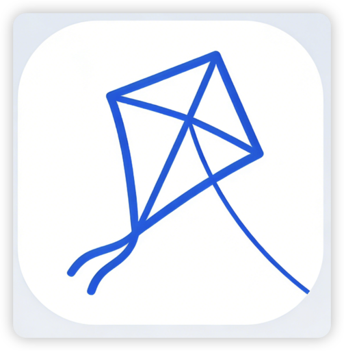

<div align="center">



# Kite

### The Missing UI for Claude Code

Put Claude Code in your pocket — the open-source desktop client that makes Claude Code's power accessible to everyone. No terminal, ever.

[](https://github.com/openkursar/hello-halo/stargazers)
[](LICENSE)
[](#installation)
[](https://github.com/openkursar/hello-halo/releases)

[Download](#installation) · [Documentation](#documentation) · [Contributing](#contributing)

 **[Español](./docs/README.es.md)** | **[Deutsch](./docs/README.de.md)** |**[中文](./docs/README.zh-CN.md)** |  **[Français](./docs/README.fr.md)** | **[日本語](./docs/README.ja.md)**

</div>

---

<div align="center">


</div>

---

## Why Kite?

**Claude Code is the most capable AI coding agent available.** But there's a problem:

> **It's trapped in a terminal.**

For developers comfortable with CLI, that's fine. But for designers, PMs, students, and anyone who just wants AI to *do things* — the terminal is a wall.

**Kite breaks down that wall.**

We took 100% of Claude Code's Agent capabilities and wrapped them in a visual interface that anyone can use. Same power, zero friction.

| | Claude Code CLI | Kite |
|---|:---:|:---:|
| Full Agent capabilities | ✅ | ✅ |
| Visual interface | ❌ | ✅ |
| One-click install | ❌ | ✅ |
| Remote access from any device | ❌ | ✅ |
| File preview & management | ❌ | ✅ |
| Built-in AI Browser | ❌ | ✅ |

> Think of it like this:
> **Windows** turned DOS into visual desktops.
> **Kite** turns Claude Code CLI into a visual AI companion.

---

## Features

<table>
<tr>
<td width="50%">

### Real Agent Loop
Not just chat. Kite can **actually do things** — write code, create files, run commands, and iterate until the task is done.

### Space System
Isolated workspaces keep your projects organized. Each Space has its own files, conversations, and context.

### Beautiful Artifact Rail
See every file AI creates in real-time. Preview code, HTML, images — all without leaving the app.

</td>
<td width="50%">

### Remote Access
Control your desktop Kite from your phone or any browser. Work from anywhere — even from a hospital bed (true story).

### AI Browser
Let AI control a real embedded browser. Web scraping, form filling, testing — all automated.

### MCP Support
Extend capabilities with Model Context Protocol. Compatible with Claude Desktop MCP servers.

</td>
</tr>
</table>

### And More...

- **Multi-provider Support** — Anthropic, OpenAI, DeepSeek, and any OpenAI-compatible API
- **Real-time Thinking** — Watch AI's thought process as it works
- **Tool Permissions** — Approve or auto-allow file/command operations
- **Dark/Light Themes** — System-aware theming
- **i18n Ready** — English, Chinese, Spanish (more coming)
- **Auto Updates** — Stay current with one-click updates

---

## Screenshots


*Remote Access: Control Kite from anywhere*


<p align="center">
  
  &nbsp;&nbsp;
  
</p>

---

## Installation

### Download (Recommended)

| Platform | Download | Requirements |
|----------|----------|--------------|
| **macOS** (Apple Silicon) | [Download .dmg](https://github.com/openkursar/hello-halo/releases/latest) | macOS 11+ |
| **macOS** (Intel) | Coming soon | macOS 11+ |
| **Windows** | [Download .exe](https://github.com/openkursar/hello-halo/releases/latest) | Windows 10+ |
| **Linux** | [Download .AppImage](https://github.com/openkursar/hello-halo/releases/latest) | Ubuntu 20.04+ |
| **Web** (PC/Mobile) | Enable Remote Access in desktop app | Any modern browser |

**That's it.** Download, install, run. No Node.js. No npm. No terminal commands.

### Build from Source

For developers who want to contribute or customize:

```bash
git clone https://github.com/openkursar/hello-halo.git
cd hello-halo
npm install
npm run dev
```

---

## Quick Start

1. **Launch Kite** and enter your API key (Anthropic recommended)
2. **Start chatting** — try "Create a simple todo app with React"
3. **Watch the magic** — see files appear in the Artifact Rail
4. **Preview & iterate** — click any file to preview, ask for changes

> **Pro tip:** For best results, use Claude Sonnet 4.5.5 or Opus 4.5.5 models.

---

## Breaking Change: Config Directory Policy

Kite now supports `~/.kite/` only.
Legacy `~/.halo/` is not read and is not migrated automatically.

### Upgrade Guide (Manual Migration)

If you need old data, manually copy required files/directories from `~/.halo/` to `~/.kite/` while Kite is closed:

- `config.json`
- `spaces/`
- `temp/`
- `skills/`, `commands/`, `agents/`, `plugins/` (if used)

---

## How It Works

```
┌─────────────────────────────────────────────────────────────────┐
│                          Kite Desktop                           │
│  ┌─────────────┐    ┌─────────────┐    ┌───────────────────┐   │
│  │   React UI  │◄──►│    Main     │◄──►│  Claude Code SDK  │   │
│  │  (Renderer) │IPC │   Process   │    │   (Agent Loop)    │   │
│  └─────────────┘    └─────────────┘    └───────────────────┘   │
│                            │                                    │
│                            ▼                                    │
│                    ┌───────────────┐                           │
│                    │  Local Files  │                           │
│                    │  ~/.kite/     │                           │
│                    └───────────────┘                           │
└─────────────────────────────────────────────────────────────────┘
```

- **100% Local** — Your data never leaves your machine (except API calls)
- **No Backend Required** — Pure desktop client, use your own API keys
- **Real Agent Loop** — Tool execution, not just text generation

---

## What People Are Building

Kite isn't just for developers. We've seen:

- **Finance teams** building full-stack apps from scratch — with zero coding experience
- **Designers** prototyping interactive mockups
- **Students** learning to code with AI as their pair programmer
- **Developers** shipping features faster than ever

The barrier isn't AI capability anymore. **It's accessibility.** Kite removes that barrier.

---

## Tech Stack

| Layer | Technology |
|-------|------------|
| Framework | Electron + electron-vite |
| Frontend | React 18 + TypeScript |
| Styling | Tailwind CSS + shadcn/ui patterns |
| State | Zustand |
| Agent Core | @anthropic-ai/claude-code SDK |
| Markdown | react-markdown + highlight.js |

---

## Roadmap

- [x] Core Agent Loop with Claude Code SDK
- [x] Space & Conversation management
- [x] Artifact preview (Code, HTML, Images, Markdown)
- [x] Remote Access (browser control)
- [x] AI Browser (CDP-based)
- [x] MCP Server support
- [ ] Plugin system
- [ ] Voice input

---

## Contributing

Kite is open source because AI should be accessible to everyone.

We welcome contributions of all kinds:

- **Translations** — Help us reach more users (see `src/renderer/i18n/`)
- **Bug reports** — Found something broken? Let us know
- **Feature ideas** — What would make Kite better for you?
- **Code contributions** — PRs welcome!

```bash
# Development setup
git clone https://github.com/openkursar/hello-halo.git
cd hello-halo
npm install
npm run dev
```

See [CONTRIBUTING.md](CONTRIBUTING.md) for guidelines.

---

## Community

- [GitHub Discussions](https://github.com/openkursar/hello-halo/discussions) — Questions & ideas
- [Issues](https://github.com/openkursar/hello-halo/issues) — Bug reports & feature requests

---

## License

MIT License — see [LICENSE](LICENSE) for details.

---

## The Story Behind Kite

A few months ago, it started with a simple frustration: **I wanted to use Claude Code, but I was stuck in meetings all day.**

During boring meetings (we've all been there), I thought: *What if I could control Claude Code on my home computer from my phone?*

Then came another problem — my non-technical colleagues wanted to try Claude Code after seeing what it could do. But they got stuck at installation. *"What's npm? How do I install Node.js?"* Some spent days trying to figure it out.

So I built Kite for myself:
- **Visual interface** — no more staring at terminal output
- **One-click install** — no Node.js, no npm, just download and run
- **Remote access** — control from phone, tablet, or any browser

The first version took a few hours. Everything after that? **100% built by Kite itself.** We've been using it daily for months.

AI building AI. Now in everyone's hands.

---

<div align="center">

### Built by AI, for humans.

If Kite helps you build something amazing, we'd love to hear about it.

**Star this repo** to help others discover Kite.

[](https://star-history.com/#openkursar/hello-halo&Date)

[⬆ Back to Top](#kite)

</div>
