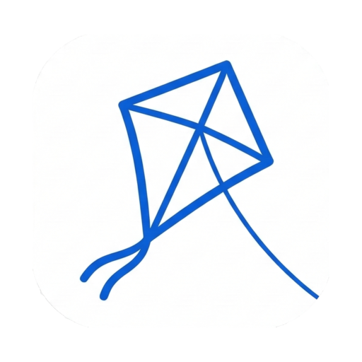

<div align="center">



# Kite

### Experience Cutting-Edge AI for Everyone

An AI assistant designed for everyone — no coding required, no setup needed, just open and use.

[](https://github.com/blackholel/buddykite/stargazers)
[](LICENSE)
[](#installation)

[Download](#installation) · [Quick Start](#quick-start) · [Use Cases](#what-can-you-do-with-kite)

**[中文](./docs/README.zh-CN.md)** | **[Español](./docs/README.es.md)** | **[Deutsch](./docs/README.de.md)** | **[Français](./docs/README.fr.md)** | **[日本語](./docs/README.ja.md)**

</div>

---

## Why Kite?

Every time I try to recommend the latest AI tools to my friends, I face the same problem:

> "Sounds cool, but I don't know how to use the command line..."
> "Install Node.js? What's that?"
> "Never mind, it's too complicated."

**AI technology is advancing rapidly, but most people are left behind.**

Not because they don't want to try, but because:
- Installation is too complex
- Requires programming knowledge
- Unfriendly interfaces
- Don't know where to start

**Kite was created to break down these barriers.**

We believe cutting-edge AI shouldn't be exclusive to programmers. Designers, writers, students, entrepreneurs, anyone with ideas should be able to easily use AI to bring their creativity to life.

---

## What is Kite?

Kite is a **ready-to-use AI assistant desktop application**.

It wraps the world's most powerful AI coding assistant (Claude Code) into a graphical interface anyone can use. You don't need to:
- ❌ Learn command line
- ❌ Install development environments
- ❌ Know programming
- ❌ Read complex documentation

You only need to:
- ✅ Download and open Kite
- ✅ Type your ideas
- ✅ Watch AI make it happen

**As simple as talking to a super-smart assistant.**

---

## What Can You Do with Kite?

### 🎨 Creative Work
"Help me design a minimalist personal website with dark mode"
- AI writes code, creates files, and shows live preview
- You see every step and can request changes anytime

### 📊 Data Analysis
"Analyze this Excel file, find sales trends and generate charts"
- Upload files, AI processes automatically
- Generates visual reports at a glance

### 📝 Content Creation
"Translate this article to English and optimize for SEO"
- AI understands context, provides professional suggestions
- Supports multiple rounds of conversation for refinement

### 🚀 Rapid Prototyping
"Create a todo app with add, delete, and mark complete features"
- See a working app in minutes
- Not satisfied? Tell AI to modify, changes apply instantly

### 🔄 Automate Repetitive Tasks
"Every time I upload an image, automatically compress and convert to WebP"
- Create custom Skills, execute with one click
- Save tons of repetitive work time

---

## Why Choose Kite?

### 🌟 True Zero Barrier
- **One-Click Install**: Download → Open → Start Using
- **Visual Interface**: All operations in GUI
- **Real-Time Feedback**: See AI's every thought and action

### 🎯 Designed for Everyone
- **Natural Conversation**: Describe needs in everyday language
- **Instant Preview**: Created files display immediately - code, web pages, images
- **Iterate Freely**: Tell AI what's wrong anytime, it adjusts instantly

### 🔧 Rich Built-in Capabilities
- **Pre-installed Skills**: Dozens of practical Skills out of the box
- **Extensible**: Create your own Skills, Commands, and Agents
- **Workspaces**: Manage different projects separately

### 🌐 Use Anywhere
- **Remote Access**: Control desktop Kite from phone or tablet
- **Multi-language**: Chinese, English, Spanish, and more
- **Cross-platform**: macOS, Windows, Linux support

---

## Quick Start

### 1. Installation

| Platform | Download | Requirements |
|----------|----------|--------------|
| **macOS** (Apple Silicon) | [Download .dmg](https://github.com/blackholel/buddykite/releases/latest) | macOS 11+ |
| **Windows** | [Download .exe](https://github.com/blackholel/buddykite/releases/latest) | Windows 10+ |
| **Linux** | [Download .AppImage](https://github.com/blackholel/buddykite/releases/latest) | Ubuntu 20.04+ |

**That simple.** Double-click to install, no other configuration needed.

### 2. Get API Key

Kite uses Claude AI (recommended) or other AI services. You need an API key:

1. Visit [Anthropic Console](https://console.anthropic.com/)
2. Sign up (if you haven't)
3. Create an API key
4. Paste the key in Kite settings

> 💡 **Tip**: Anthropic usually offers free credits for new users, enough to experience all features.

### 3. Start Creating

Open Kite and try these:

**First Try**:
```
"Hello! Help me create a simple calculator webpage"
```

**Go Further**:
```
"Analyze the sales.csv file on my desktop, tell me which month had the highest sales"
```

**Get Creative**:
```
"Design a Pomodoro timer app, 25 minutes work, 5 minutes break, with notification sounds"
```

---

## Core Features

### 💬 Smart Conversation
- Describe your needs like chatting with a friend
- AI asks questions to confirm details
- Supports uploading images and files as reference

### 📁 Workspaces (Spaces)
- Create separate spaces for different projects
- Each space has its own conversation history and files
- Switch easily without interference

### 🎨 Live Preview
- Right panel shows all files AI creates
- Supports code highlighting, web preview, image viewing
- Click any file to view or edit

### 🔧 Custom Capabilities
- **Skills**: Create reusable skills (like "compress images", "generate reports")
- **Commands**: Define quick commands
- **Agents**: Configure specialized AI assistants (like "frontend expert", "data analyst")

### 📱 Remote Access
- Enable remote access in settings
- Access the displayed address from your phone browser
- Control your Kite from anywhere

### 🌍 Multi-language
- Interface supports Chinese, English, and more
- AI conversation adapts to your language automatically

---

## Tips for Success

### 💡 How to Ask Good Questions

**Not Clear Enough**:
```
"Make a website"
```

**Better Way**:
```
"Create a personal portfolio website with homepage, about me, and projects pages,
using modern minimalist style with deep blue as the primary color"
```

### 🔄 Iterate and Improve

Don't expect perfection on the first try. Tell AI what needs adjustment:

```
"The homepage title is too large, make it smaller"
"Change button color to green"
"Add a contact form"
```

### 📦 Create Your Own Skills

Find yourself doing the same thing often? Create a Skill:

1. Click Skills panel on the left
2. Click "Create New Skill"
3. Describe what this Skill should do
4. Use it with one click later

---

## Real Stories

### Story 1: Non-Technical Founder's Product Prototype
> "I'm an entrepreneur who doesn't code. Used Kite to create my product's first working prototype
> in one afternoon to show investors. They were all amazed."

### Story 2: Designer's Code Assistant
> "I'm a UI designer who often needs interactive prototypes. Used to ask frontend colleagues for help,
> now I can do it myself with Kite. 10x efficiency boost."

### Story 3: Student's Learning Partner
> "I'm learning to code, Kite not only helps me write code but explains what each step does.
> Learning much faster than watching tutorials."

### Story 4: Content Creator's Efficiency Tool
> "I need to process lots of images and documents. After creating a few custom Skills,
> work that took a day now takes 10 minutes."

---

## FAQ

### Q: I don't know programming at all, can I use Kite?
**A:** Absolutely! Kite is designed for you. Describe what you want in natural language, AI handles all technical details.

### Q: Does it cost money?
**A:** Kite itself is completely free and open source. You only pay for AI service (like Claude) API fees, usually very affordable with free credits for new users.

### Q: Is my data safe?
**A:** All data is stored on your computer, not uploaded to any server (except conversation content sent to AI). You have complete control over your data.

### Q: Which AI services are supported?
**A:** Supports Anthropic Claude (recommended), OpenAI, DeepSeek, and any OpenAI API-compatible service.

### Q: Can I use it offline?
**A:** Requires internet connection to call AI services, but all file management and preview features are local.

---

## Technical Details

<details>
<summary>Click to expand tech stack info (for developers)</summary>

### Architecture
- **Framework**: Electron + React 18 + TypeScript
- **State Management**: Zustand
- **Styling**: Tailwind CSS
- **AI Core**: @anthropic-ai/claude-code SDK
- **Markdown Rendering**: react-markdown + highlight.js

### Core Capabilities
- Complete Agent Loop (tool execution, file operations, command running)
- MCP (Model Context Protocol) server support
- Multi-modal input (text, images, files)
- Streaming message processing
- Tool permission management

### Local Development
```bash
git clone https://github.com/blackholel/buddykite.git
cd buddykite
npm install
npm run dev
```

</details>

---

## Join the Community

- [GitHub Discussions](https://github.com/blackholel/buddykite/discussions) — Ask questions, share experiences
- [Issues](https://github.com/blackholel/buddykite/issues) — Report bugs, suggest features
- [Contributing Guide](CONTRIBUTING.md) — Help improve Kite

---

## License

MIT License — see [LICENSE](LICENSE) for details

---

## Our Vision

**AI should not be a privilege for the few.**

Everyone has the right to create, everyone should be able to use the most advanced tools to realize their ideas.

Kite is just the beginning. We hope to:
- Let more people discover the magic of AI
- Inspire curiosity and creativity
- Lower the barrier to technology
- Enable everyone to become a creator

If Kite helped you realize an interesting idea, we'd love to hear your story.

**Star this project ⭐** to help more people discover Kite.

---

<div align="center">

### AI for Everyone

[⬆ Back to Top](#kite)

</div>
